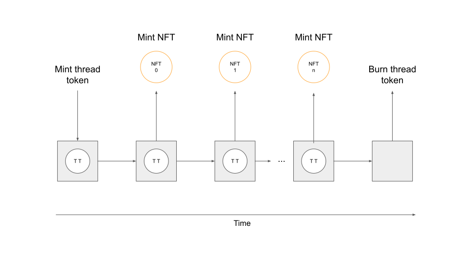

The process consists of 3 scripts.

The first script is a minting policy <b>X</b> that creates a one time thread token that is sent to a script output of the validator script.

The validator script <b>Y</b> is a state machine and increases a counter id after each mint.

The actual mint happens in a seperate minting policy <b>Z</b>. The mint only happens if the state machine <b>Y</b> successfully transitioned and the token name includes the correct counter id.
